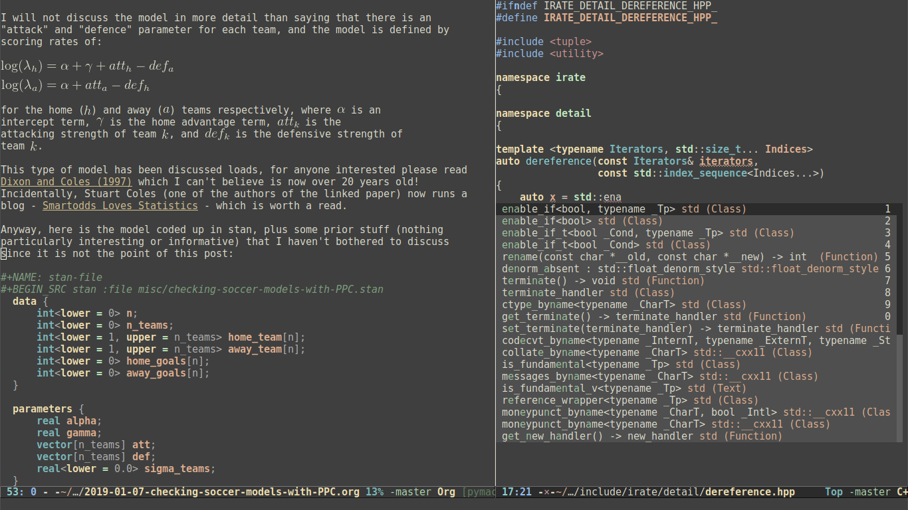

# .emacs.d

My emacs stuff.

- install [ninja](https://github.com/ninja-build/ninja)
- install [clang](http://releases.llvm.org/download.html)
- run some build scripts
- `$HOME/bin` is in the path i.e: put `export PATH=$PATH:$HOME/bin` somewhere
- run `ln -s $HOME/.emacs.d/.Xresources $HOME/.Xresources`
- run `xrdb ~/.Xresources`

